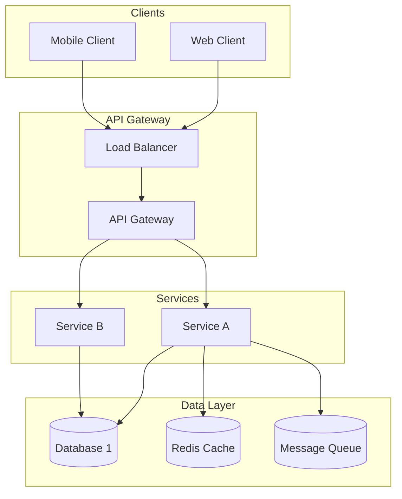
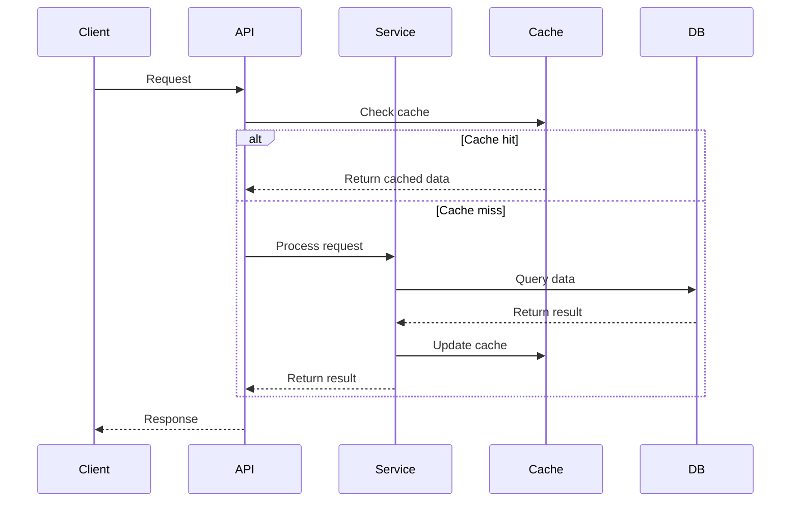
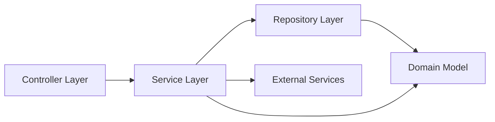
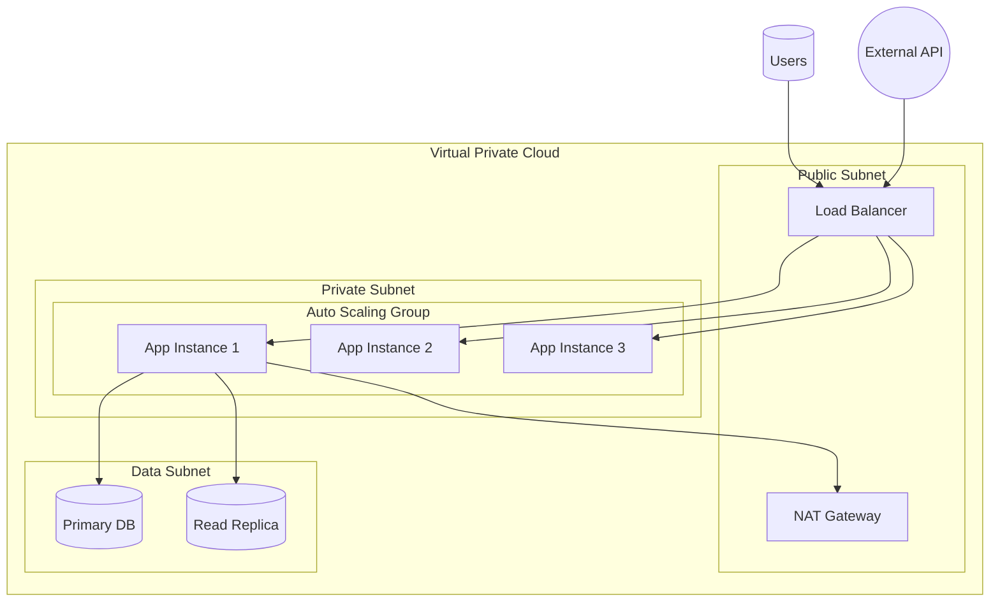
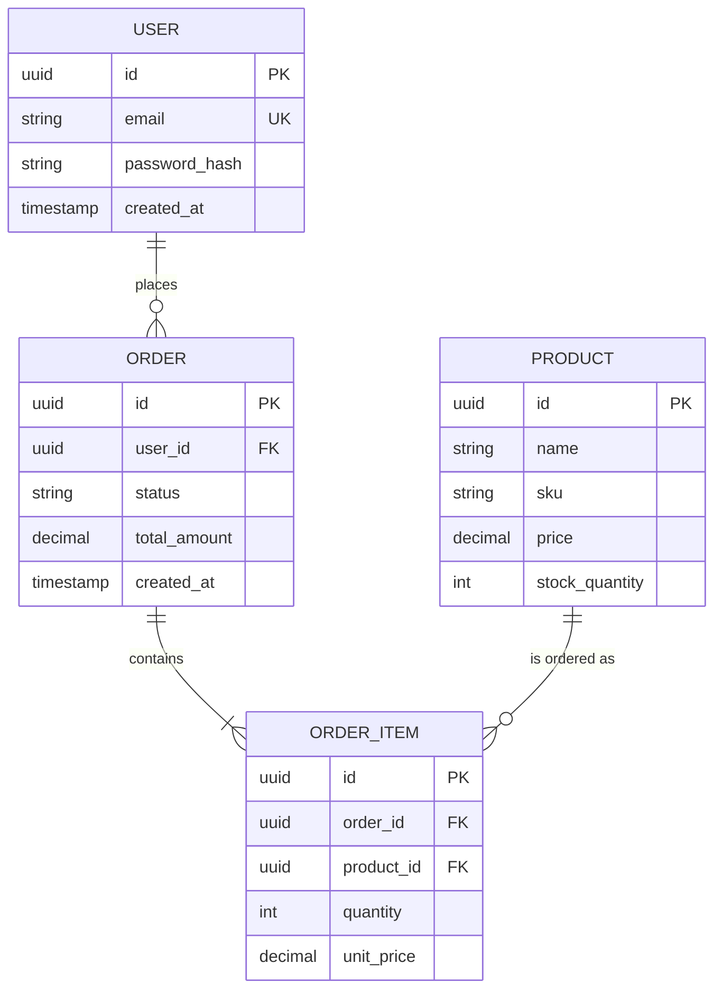
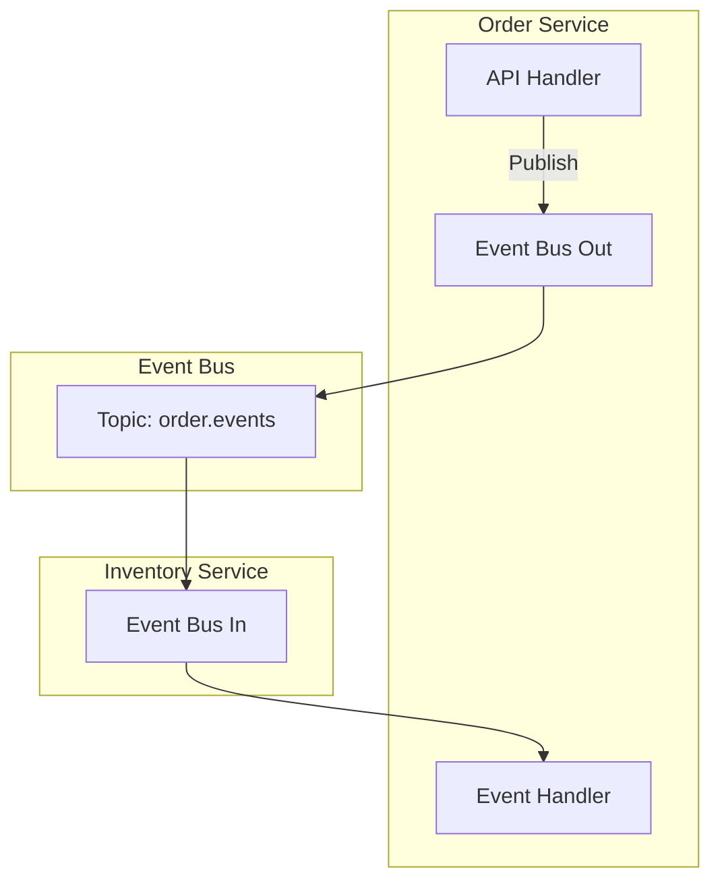

# Tech Arch Writer

Generate professional technical architecture documentation for software systems from either existing code analysis or architectural requirements design.

## Workflow Decision Tree

Determine the task type:

**Generating docs from existing code?** → Follow "Code Analysis Workflow" below
**Designing architecture from requirements?** → Follow "Architecture Design Workflow" below

## Code Analysis Workflow

Generate architecture documentation by analyzing an existing codebase.

### Step 1: Understand the Scope

- Identify the codebase root directory
- Clarify the system type (backend service, full-stack application, microservices, etc.)
- Understand the primary business domain
- Identify key technologies and frameworks in use

### Step 2: Explore and Analyze

Use Explore agent to systematically discover the codebase structure:

```
Thoroughness: "medium"
Focus areas:
- Entry points and main applications
- API controllers/handlers
- Service layer organization
- Data models and schemas
- Configuration files
- Infrastructure/deployment code
```

### Step 3: Document Structure

Generate markdown document following [Template Structure](#document-template).

### Step 4: Create Architecture Diagnostics

Review and generate appropriate mermaid diagrams:
- System architecture diagram (high-level components)
- Data flow diagram (request/response flow)
- Component relationship diagram (dependencies)
- Deployment architecture diagram (infrastructure)

## Architecture Design Workflow

Design new system architecture from user requirements.

### Step 1: Gather Requirements

Analyze user requirements to understand:
- Business goals and objectives
- Functional requirements
- Non-functional requirements (scalability, performance, security)
- Integration points with external systems
- Constraints (budget, timeline, technology constraints)

### Step 2: Make Architectural Decisions

Apply [Architectural Design Principles](#architectural-design-principles):

**Domain-Driven Design (DDD) approach:**
- Identify bounded contexts and domains
- Define aggregates and value objects
- Separate concerns between domains

**Technology Stack Selection:**
- Choose appropriate languages and frameworks
- Consider deployment infrastructure
- Evaluate caching, messaging, storage options

**Scalability and Resilience:**
- Stateless services design
- Event-driven patterns where appropriate
- Circuit breakers, retries, timeout policies
- Horizontal scaling capability

**Security Patterns:**
- Authentication/authorization approach
- Data encryption requirements
- API security best practices

### Step 3: Design Components

Design core components with clear responsibilities:
- Presentation layer (API/Controllers)
- Application layer (Use cases/Application services)
- Domain layer (Business rules/Entities)
- Infrastructure layer (Data access/External services)

### Step 4: Document and Diagram

Generate markdown document combining:
- Architecture overview
- Component descriptions
- Data model design
- API specification
- Deployment architecture
- Security considerations

### Step 5: Generate Mermaid Diagrams

Create appropriate diagrams using [Mermaid Patterns](#mermaid-patterns)

## Document Template

Use this structure for generated documents:

```markdown
# [System Name] Architecture Documentation

## 1. Architecture Overview
- [System purpose and goals]
- [Key architectural patterns]
- [High-level component description]

## 2. System Architecture Diagram
[Mermaid graph showing main components]

## 3. Technology Stack
| Layer | Technology | Rationale |
|-------|-----------|-----------|
| Language | [Language] | [Reasoning] |
| Framework | [Framework] | [Reasoning] |
| Database | [Database] | [Reasoning] |
| Infrastructure | [Platform] | [Reasoning] |

## 4. Core Components

### [Component 1 Name]
- **Purpose**: [Functionality]
- **Key Dependencies**: [Other components]
- **Key Interfaces**: [Public methods/contracts]

### [Component 2 Name]
[Similar structure]

## 5. Data Flow Diagram
[Mermaid sequence diagram]

## 6. Data Model
[Mermaid ER diagram and entity descriptions]

## 7. API Design
[Endpoint specifications or API overview]

## 8. Architectural Decisions
| Decision | Rationale | Trade-offs |
|----------|-----------|------------|
| [Decision 1] | [Why] | [Alternatives considered] |

## 9. Deployment Architecture
[Mermaid deployment diagram]

## 10. Security Considerations
- Authentication/Authorization
- Data protection
- API security
- Infrastructure security

## 11. Scalability & Performance
- Scaling strategy
- Performance expectations
- Bottleneck mitigation

## 12. Future Considerations
- [Potential enhancements]
- [Migration paths]
```

## Mermaid Patterns

### System Architecture Diagram



### Data Flow Diagram



### Component Relationship Diagram



### Deployment Architecture Diagram



### Entity Relationship Diagram



### Microservices Communication Pattern



## Architectural Design Principles

### 1. Layered Architecture

Organize code into clear layers with strict dependencies:

- **Presentation Layer**: HTTP handlers, GraphQL resolvers, gRPC endpoints
- **Application Layer**: Use cases, application services, orchestration
- **Domain Layer**: Business entities, value objects, business rules
- **Infrastructure Layer**: Database access, external service clients, file I/O

**Rule**: Upper layers depend on lower layers. Infrastructure depends on domain (dependency inversion).

### 2. Domain-Driven Design (DDD)

Apply DDD patterns for complex business domains:

**Bounded Contexts**: Separate distinct business domains with explicit boundaries
**Aggregates**: Cluster related entities around aggregate roots
**Value Objects**: Immutable objects with no identity
**Domain Events**: Capture significant business events for async processing
**Repositories**: Abstract data access behind domain-focused interfaces

### 3. Event-Driven Architecture

Use events for decoupled, scalable systems:

**Domain Events**: Represent business state changes
**Event Sourcing**: Store events as single source of truth (when appropriate)
**CQRS**: Separate read and write models for complex queries
**Message Broker**: Use Kafka/RabbitMQ for reliable event delivery

### 4. API Design Patterns

**REST**: Resource-based API with proper semantics (GET/POST/PUT/DELETE)
**GraphQL**: Client-specified queries for complex data requirements
**gRPC**: High-performance RPC for internal service communication
**API Versioning**: Never break backward compatibility, use version headers or URLs

### 5. Data Access Patterns

**Repository Pattern**: Abstract database operations
**Unit of Work**: Group multiple operations into single transaction
**Database per Service**: Microservices own their data
**Read/Write Split**: Separate read replicas for read-heavy workloads
**Caching Strategy**: Cache frequently accessed data, invalidate on writes

### 6. Scalability Patterns

**Horizontal Scaling**: Stateless services that can be easily replicated
**Connection Pooling**: Reuse database connections, don't create per-request
**Rate Limiting**: Protect services from abuse and cascading failures
**Circuit Breakers**: Fail fast when downstream services are unhealthy
**Bulkheads**: Isolate resource pools to prevent cascading failures

### 7. Security First Design

**Defense in Depth**: Multiple security layers
**Principle of Least Privilege**: Minimal access required
**Input Validation**: Validate at boundaries, trust nothing from external input
**Output Encoding**: Prevent XSS and injection attacks
**Secure Communication**: TLS everywhere
**Secrets Management**: Never hardcode credentials, use vault/KMS
**Audit Logging**: Track who did what when

### 8. Observability

**Structured Logging**: Consistent, parseable log format
**Metrics**: Track key health indicators (latency, throughput, error rate)
**Distributed Tracing**: Track requests across service boundaries
**Health Checks**: Expose readiness/liveness endpoints
**Exception Tracking**: Centralized error monitoring

## Technology Stack Examples

### Backend Service

**Language**: Go (for high performance, low latency microservices)
**Framework**: tRPC-Go (for internal service communication)
**Database**: PostgreSQL (relational) + Redis (cache)
**Message Queue**: Kafka (event streaming)
**Deployment**: Kubernetes with auto-scaling

### Web Application

**Language**: Node.js/TypeScript
**Framework**: Next.js (SSR/SSG)
**Database**: PostgreSQL
**ORM**: Prisma
**Authentication**: NextAuth.js
**Deployment**: Vercel or container-based

### Data Pipeline

**Language**: Python
**Framework**: Airflow (orchestration)
**Database**: BigQuery (warehouse) + ClickHouse (OLAP)
**Message Queue**: Kafka (events)
**Deployment**: GCP Dataflow
